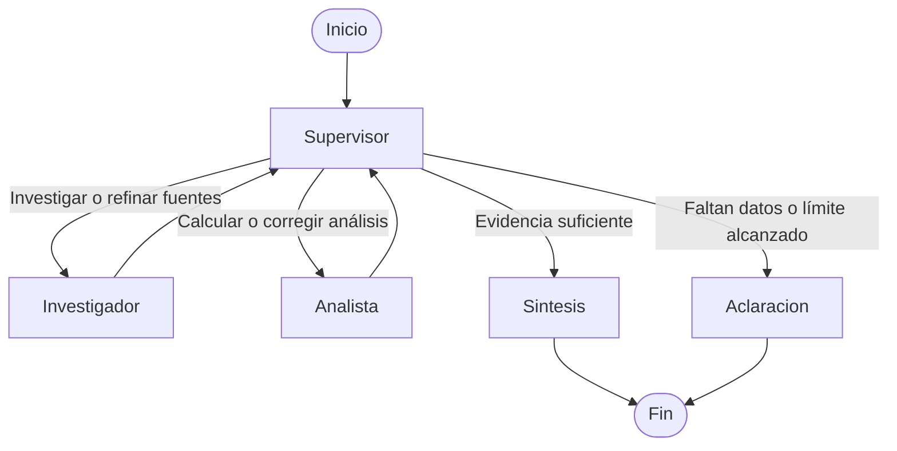

# Pre-entrega 6: diseño del orquestador especializado

## Objetivo y alcance

Prototipo asíncrono en Python 3.12 que investiga conceptos de estadística, calcula resultados sobre datos del usuario y sintetiza una respuesta con fuentes. Se mantiene independiente de las entregas anteriores, sin servicios nuevos ni búsqueda web en tiempo de ejecución.

Caso de demostración: «Buscá cómo comparar dos grupos y analizá estos tiempos de respuesta. ¿Cuál tiene menor promedio y cuál es más consistente?». Datos sintéticos en milisegundos: A = [100, 110, 90, 100, 100] y B = [80, 120, 100, 90, 110]. Ambos promedios son 100; A tiene menor dispersión. La conclusión es descriptiva, no una prueba de significancia estadística.

## Topología

El Supervisor usa una respuesta estructurada con destino limitado por `Literal`. Decide la delegación a partir de la consulta, los aportes disponibles y una rúbrica explícita. No se fija una secuencia por palabras clave. Los límites y controles de integridad son deterministas; no sustituyen la decisión del modelo.

El patrón jerárquico centraliza la revisión. Los especialistas no se delegan tareas entre sí. Cada uno recibe únicamente su instrucción, los datos necesarios y los aportes pertinentes, en lugar de todo el historial.

## Especialistas y herramientas

- **Investigador:** prompt especializado y herramienta `@tool` de búsqueda real sobre una base documental local de estadística. Los documentos breves incluyen identificador y referencia de origen. La búsqueda devuelve fragmentos y fuentes; una búsqueda sin coincidencias devuelve un resultado vacío, no evidencia inventada. Se utiliza una base local consultable para mantener reproducible la demostración.
- **Analista:** prompt especializado y herramienta `@tool` de cálculo con la biblioteca estándar de Python. Calcula tamaño, promedio, mediana y desviación estándar muestral de cada grupo. Valida al menos dos números finitos por grupo, unidades homogéneas y tamaño acotado. No ejecuta código generado por el modelo ni utiliza `eval`.
- **Síntesis:** combina las fuentes recuperadas y los resultados numéricos verificados. Explica las limitaciones y diferencia descripción de inferencia estadística.

Los especialistas seleccionan sus herramientas mediante el modelo. Cada llamada deja un registro observable de agente, herramienta, argumentos y resultado, sin solicitar razonamiento interno privado.

## Estado y validación

`state.py` define un estado que extiende `MessagesState`, con consulta original, grupos de datos, siguiente agente, instrucción de delegación, aportes identificados por agente, contador de delegaciones y estado de finalización.

Los contratos de entrada, decisiones y aportes se validan con Pydantic. Cada aporte identifica su autor, fuentes o resultados de herramienta y su estado: completo, incompleto o error. Las correcciones conservan trazabilidad del aporte anterior.

Antes de sintetizar, el Supervisor verifica su rúbrica: fuentes pertinentes, ambos grupos analizados, cálculos respaldados por la herramienta, unidades coherentes y ausencia de contradicciones pendientes. Los controles de código impiden marcar como completado el caso comparativo sin evidencia de investigación y cálculo. Si hay discrepancias, se solicita una corrección al especialista correspondiente; no se promedian opiniones ni se aceptan números sin respaldo.

## Resiliencia

Máximo de seis delegaciones del Supervisor, límite de recursión del grafo y límite propio para las llamadas internas de cada especialista. Al agotar el presupuesto, se devuelve una limitación explícita, no una conclusión presentada como validada.

Errores temporales de API con timeout y reintentos acotados; errores de herramienta y validación devueltos como aportes controlados. Logs de duración para modelo, herramientas y ejecución. Secretos exclusivamente en `.env`, ignorado por Git, con `.env.example` sin claves. Se conserva Luna como modelo configurable, sujeto a verificar acceso al ejecutar.

No se agrega persistencia SQLite ni infraestructura multiusuario: no son requisitos de esta entrega. El estado compartido se conserva durante cada ejecución del grafo.

## Archivos y demostración

`state.py`, `agents/research_agent.py`, `agents/analyst_agent.py`, Supervisor, `graph.py`, CLI, documentos locales, configuración, dependencias y pruebas. Los módulos auxiliares se separarán solo cuando tengan una responsabilidad clara.

El README incluirá instalación, variables, ejecución, topología Mermaid, resolución de conflictos y límites. Un `demo.ipynb` ejecutado mostrará entrada, delegaciones, herramientas, correcciones cuando correspondan y respuesta final. No se sustituye el notebook por un informe. Se usará `await` en las celdas, sin anidar `asyncio.run` en el kernel.

## Verificación de aceptación

1. Cálculos contrastados con valores conocidos; rechazo de grupos vacíos, insuficientes o no finitos.
2. Recuperación de fuentes y comportamiento explícito cuando no hay resultados.
3. Estado que conserva e identifica los aportes de ambos especialistas.
4. Enrutamiento dinámico, solicitud de refinamiento y bloqueo de una finalización incompleta, con modelo simulado en tests.
5. Terminación controlada ante delegaciones repetidas y errores esperados.
6. Demo real con ambos especialistas, herramientas funcionales y síntesis final; errores de proveedor no se presentan como ejecución exitosa.
7. Notebook sin secretos, README coherente con los comandos comprobados y revisión final del diff.

Rúbrica cubierta: documentación y diagrama (20 %), arquitectura jerárquica y delegación dinámica (35 %), especialistas con herramientas y estado validado (45 %).

## Publicación

Trabajo local en `main`. No se modifican los cambios pendientes de ejercicios anteriores. No se hace push hasta que el usuario revise y autorice la publicación.
