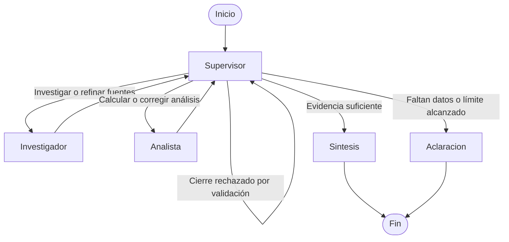

# Pre-entrega 6 · Orquestador multi-agente especializado

Un Supervisor coordina dos especialistas para comparar muestras numéricas: el Investigador consulta apuntes de estadística y el Analista calcula resultados con Python. Después se genera una síntesis con fuentes y una tabla de resultados verificables.

El caso de ejemplo compara tiempos de respuesta. Los datos son sintéticos, pero la búsqueda, los cálculos y las llamadas al modelo son reales. No hay una secuencia de agentes elegida por palabras clave.

## Preparación

Desde `14_preentrega_6`, con Python 3.12:

```powershell
py -3.12 -m venv .venv
.\.venv\Scripts\python.exe -m pip install -r requirements.txt
Copy-Item .env.example .env
```

Copiá `.env.example` solo en la primera instalación para no reemplazar tu configuración. Completá `.env`:

```dotenv
OPENAI_API_KEY=tu_clave_real
OPENAI_MODEL=gpt-5.6-luna
```

Necesitás acceso a ese modelo y saldo de API. No hacen falta claves de Tavily ni Pinecone. `.env`, el entorno virtual y las salidas de `storage/` quedan fuera de Git. No publiques trazas con datos personales sin revisarlas.

## Ejecutar una consulta

```powershell
.\.venv\Scripts\python.exe main.py --input examples/comparison.json --trace storage/consulta.json
```

La entrada separa la pregunta de los valores numéricos:

```json
{
  "query": "Compará promedio y dispersión y explicá las fuentes.",
  "groups": [
    {"name": "A", "unit": "ms", "values": [100, 110, 90, 100, 100]},
    {"name": "B", "unit": "ms", "values": [80, 120, 100, 90, 110]}
  ]
}
```

Podés cambiar los datos y nombres en otro JSON y pasarlo con `--input`. El prototipo compara dos grupos en la misma unidad. No extrae muestras desde PDFs ni convierte unidades automáticamente. Cada grupo necesita al menos dos números finitos para calcular el desvío muestral. No se aceptan booleanos ni cadenas en lugar de números.

## Topología jerárquica



La jerarquía concentra las decisiones en un solo Supervisor. Los especialistas tienen responsabilidades acotadas y devuelven su aporte; no deciden el flujo global. El Supervisor puede volver a delegar si un resultado está incompleto. La síntesis es una fase separada para no confundir recuperar información con concluir.

| Componente | Responsabilidad |
| --- | --- |
| `state.py` | Contratos Pydantic y estado compartido basado en `MessagesState`. |
| `agents/research_agent.py` | Buscar conceptos y fuentes en `data/`. |
| `agents/analyst_agent.py` | Calcular estadísticas sobre los datos validados del usuario. |
| `agents/common.py` | Ejecutar el ciclo acotado de herramientas que comparten ambos especialistas. |
| `tools/` | Búsqueda léxica y cálculo numérico, separados de las decisiones del modelo. |
| `agents/supervisor.py` | Decidir la siguiente intervención y revisar suficiencia. |
| `graph.py` | Componer el `StateGraph`, validar la finalización y ejecutar el flujo asíncrono. |
| `main.py` | Leer la solicitud, ejecutar y exportar la traza. |
| `demo.ipynb` | Demostrar la delegación con outputs visibles. |

## Herramientas y fuentes

El Investigador elige una consulta y llama a `buscar_fuentes`. La búsqueda léxica local consulta tres apuntes propios en JSON, con identificador, título, texto y URL de referencia:

- [Centro: media y mediana](data/centro.json), basado en [NIST: Measures of Location](https://www.itl.nist.gov/div898/handbook/eda/section3/eda351.htm).
- [Dispersión y consistencia](data/dispersion.json), basado en [NIST: Measures of Scale](https://www.itl.nist.gov/div898/handbook/eda/section3/eda356.htm).
- [Límites de la comparación](data/comparacion.json), con referencia a [NIST: Two-Sample t-Test](https://www.itl.nist.gov/div898/handbook/eda/section3/eda353.htm).

No son copias completas del manual ni búsquedas web en vivo. La base es pequeña y deliberadamente reproducible; las URLs documentan el origen conceptual. Los errores de lectura o validación de archivos se registran como tales, sin inventar documentos recuperados.

El Analista llama a `calcular_estadisticas`. La herramienta recibe los grupos a través del contexto de ejecución, no arrays reescritos por el modelo. Usa `statistics` para calcular cantidad, media, mediana y desviación estándar muestral. No ejecuta código generado ni usa `eval`.

## Estado, validación y conflictos

El estado conserva aportes identificados por agente y eventos de ejecución. Cada especialista recibe su instrucción y los datos pertinentes, no todo el historial de todos los agentes. El Investigador recibe la pregunta y un resumen de los grupos (nombre, unidad y cantidad), sin las observaciones numéricas. El Analista recibe los valores originales y, si está disponible, el último aporte válido de investigación. Una corrección no borra la procedencia anterior; para decidir si puede finalizar, se considera la versión más reciente de cada aporte.

El Supervisor tiene una rúbrica: fuentes pertinentes, análisis de ambos grupos, unidades comparables y ausencia de contradicciones. Pydantic valida los contratos; las comprobaciones deterministas impiden aceptar una conclusión sin resultados de herramientas. El modelo decide a quién consultar; el código controla límites e integridad.

El Supervisor puede solicitar refinamiento al especialista que debe resolver un conflicto. Los números calculados y las fuentes recuperadas son el respaldo, no la seguridad con la que un agente redacta. Si intenta cerrar antes de reunir evidencia, recibe un mensaje de validación y decide nuevamente. Si la síntesis contradice los ganadores numéricos calculados, se rechaza y termina como incompleta; no se publica como una conclusión válida.

El flujo admite hasta **6 delegaciones**, **10 decisiones de modelo del Supervisor**, **3 llamadas al modelo por intervención de especialista** y una sola herramienta por respuesta. `recursion_limit=32` acota adicionalmente el grafo. OpenAI tiene timeout de 30 segundos por intento y hasta 2 reintentos del SDK para fallos transitorios. Los logs registran tiempos de modelo, herramientas y ejecución. La ventana de trabajo es una ejecución: no se incorpora memoria SQLite entre consultas.

Las comparaciones estructuradas de menor media y menor desvío se verifican con código. La explicación cualitativa sigue siendo generada por el modelo y no tiene una garantía completa contra alucinaciones; las instrucciones y la revisión del Supervisor reducen ese riesgo, pero no lo eliminan.

## Notebook de demostración

```powershell
.\.venv\Scripts\python.exe -m pip install -r requirements-demo.txt
.\.venv\Scripts\python.exe -m notebook demo.ipynb
```

Abrí [demo.ipynb](demo.ipynb) y ejecutá las celdas en orden. El notebook usa `await run_analysis(...)`, muestra las decisiones observables, los resultados de las herramientas, los aportes compartidos y la respuesta. No muestra razonamiento interno privado.

El dataset permite comprobar independientemente el resultado: ambos grupos tienen media y mediana de 100 ms; los desvíos muestrales son aproximadamente 7,071 ms para A y 15,811 ms para B. A presenta menor dispersión en esa muestra. No se puede inferir significancia estadística ni causalidad de esta comparación descriptiva.

### Ejecución incluida

El notebook ya contiene una ejecución real del 28/09/2026 con Python 3.12.13 y `gpt-5.6-luna`. El Supervisor eligió Investigación → Análisis → Síntesis, con dos llamadas a herramientas. Finalizó correctamente en 31,87 segundos y las comprobaciones independientes del notebook confirmaron los resultados numéricos. Este tiempo corresponde a una sola corrida, no a un benchmark.

La [traza JSON](evidencias/demo_result.json) conserva decisiones, aportes, resultados y tiempos. En esta corrida no hizo falta refinamiento; los casos de corrección y cierre prematuro se verifican en las pruebas controladas. Volver a ejecutar el notebook consume API y puede cambiar la redacción, el recorrido y la duración.

## Pruebas sin consumir API

```powershell
.\.venv\Scripts\python.exe -m pytest -q
```

Las pruebas usan modelos simulados para controlar las decisiones, pero ejecutan las herramientas y el grafo reales. La demo con el proveedor complementa esos tests: es la que permite observar la selección de agentes y herramientas por el modelo.

Validación local del 28/09/2026: **38 pruebas aprobadas**, revisión de Ruff y formato sin errores. El [registro de verificación](evidencias/verificacion.txt) incluye los comandos y resultados. Se cubren contratos, cifras, contexto aislado, refinamientos, errores del proveedor y límites del ciclo; no son pruebas de carga ni una evaluación estadística de precisión del LLM.

## Alcance y evaluación

| Rúbrica | Evidencia en la entrega |
| --- | --- |
| Documentación · 20 % | Instrucciones, topología Mermaid y notebook. |
| Arquitectura del grafo · 35 % | Supervisor, aristas condicionales y retorno de especialistas. |
| Especialización y estado · 45 % | Herramientas diferenciadas, aportes por agente y validaciones. |

Esto es un prototipo local de comparación descriptiva. No es un buscador general, una plataforma de experimentación estadística ni un servicio multiusuario. Los tests controlados y una demo real no prueban una tasa de éxito general. No se implementan autenticación, carga concurrente de producción ni acceso a información en tiempo real.

Referencias de implementación: [StateGraph y patrones de agentes](https://docs.langchain.com/oss/python/langgraph/workflows-agents), [aristas condicionales](https://reference.langchain.com/python/langgraph/graph/state/StateGraph/add_conditional_edges) y [GPT-5.6 Luna](https://developers.openai.com/api/docs/models/gpt-5.6-luna).
