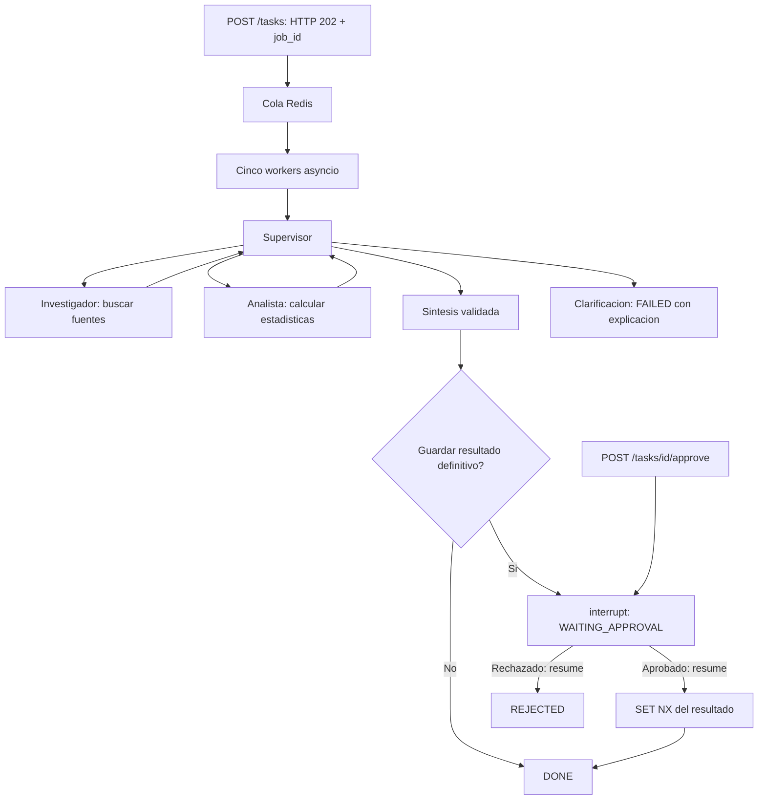
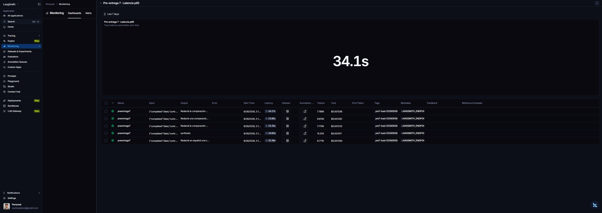
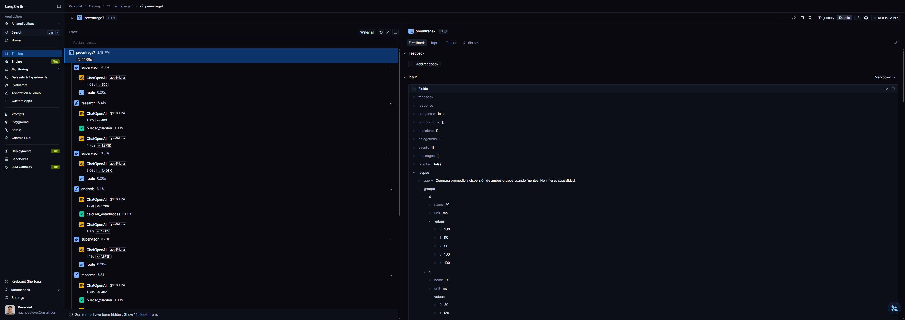

# Pre-entrega 7 — API estadística persistente

Versión independiente del Supervisor y especialistas del módulo 6. Conserva delegación dinámica, investigación sobre corpus local, herramientas reales y comprobación determinista de cifras. El modelo es `gpt-6-luna`.

## Topología



`AsyncRedisSaver` guarda los checkpoints de cada nodo. LangSmith instrumenta el grafo, los modelos y las herramientas; no es necesario envolver otra vez cada llamada de LangChain con un decorador.

`save_result=true` pausa con `interrupt()` antes de escribir `pre7:result:<uuid>`. Una aprobación autenticada encola `Command(resume=...)` sobre el mismo UUID/checkpoint. Una negativa termina REJECTED sin registro definitivo. El resultado visible antes de aprobar es un borrador.

## Ejecutar

Python 3.12, Docker y claves propias. Desde esta carpeta:

```powershell
py -3.12 -m venv .venv
.venv/Scripts/python -m pip install -r requirements.txt
Copy-Item .env.example .env
# Completar .env sin publicar secretos.
docker compose up -d redis
.venv/Scripts/python -m uvicorn app.main:create_app --factory --host 127.0.0.1 --port 18070 --workers 1
```

Alternativamente `docker compose up --build` inicia ambos servicios. API `127.0.0.1:18070`; Redis `127.0.0.1:16379`, volumen propio y AOF. No usa ni limpia bases compartidas. Para revisar salud, `GET /health` consulta Redis; errores de conexión responden 503.

Completá `OPENAI_API_KEY` y `LANGSMITH_API_KEY` con claves propias. Generá dos tokens diferentes para `API_KEY` y `APPROVAL_KEY` (al menos 16 caracteres), por ejemplo ejecutando dos veces `python -c "import secrets; print(secrets.token_urlsafe(32))"`. Estos tokens protegen nuestra API, no son las claves de los proveedores. `.env` se carga también en ejecución nativa sin reemplazar variables ya exportadas. Conservá `LANGSMITH_TRACING=true`, el endpoint y el proyecto de `.env.example`.

Dependencias: FastAPI/Uvicorn para HTTP; Redis y langgraph-checkpoint-redis para cola/checkpoints; LangGraph/LangChain/OpenAI para el orquestador; Pydantic Settings para configuración; HTTPX y pytest para demo/pruebas. `requirements.txt` fija las versiones directas y transitivas verificadas. Redis 8 incluye las capacidades JSON/Search que necesita el checkpointer.

## Probar aprobación humana

Con la API encendida, abrí `http://127.0.0.1:18070/docs`, o usá estos comandos desde esta carpeta. Reemplazá los tokens y `JOB_ID` con tus valores; no publiques tu historial de terminal.

```powershell
curl.exe -X POST http://127.0.0.1:18070/tasks -H "Content-Type: application/json" -H "X-API-Key: TU_API_KEY" --data-binary "@examples/task.json"
curl.exe http://127.0.0.1:18070/tasks/JOB_ID -H "X-API-Key: TU_API_KEY"
```

Cuando el estado sea `WAITING_APPROVAL`, revisá `interruption.response`. Podés detener y volver a iniciar la API antes de continuar: el mismo `job_id` conserva el checkpoint. Para aprobar desde PowerShell:

```powershell
$headers = @{ 'X-API-Key' = 'TU_API_KEY'; 'X-Approval-Key' = 'TU_APPROVAL_KEY' }
Invoke-RestMethod -Method Post -Uri http://127.0.0.1:18070/tasks/JOB_ID/approve -Headers $headers -ContentType 'application/json' -Body '{"approved":true}'
```

Volvé a consultar el estado hasta `DONE` y `result.saved=true`. Usar `false` termina en `REJECTED`. La política identifica como crítica la escritura definitiva, no la consulta estadística. Sin `save_result=true` no hay efecto secundario definitivo ni pausa.

## Contrato y seguridad

- `POST /tasks`: query, groups, save_result boolean y batch_id opcional; 202 con job_id/status sin esperar ejecución.
- `GET /tasks/{uuid}`: job_id,status,result,error,interruption,trace_id.
- `POST /tasks/{uuid}/approve`: approved boolean; exige X-API-Key y además X-Approval-Key diferente. Aprobación inexistente 404, estado incorrecto o duplicado 409, credencial de aprobación inválida 403.
- Toda operación de tareas exige X-API-Key. Estado: PENDING, RUNNING, WAITING_APPROVAL, DONE, FAILED, REJECTED. Los mensajes de error no exponen excepciones ni secretos.

El API no es público y no incluye autorización multiusuario. Los poseedores de X-API-Key pueden leer todas las tareas; usar únicamente datos sintéticos. Redis y API son loopback. Nunca incorporar `.env` al repositorio. Para exposición remota hacen falta TLS, autorización por propietario, límites de entrada y política de retención.

## Durabilidad y recuperación

La creación, encolado, toma de trabajo y aprobación son transacciones Lua atómicas. Un UUID tiene una única ejecución RUNNING; cola repetida o aprobación simultánea no inicia otra. Cinco consumidores pertenecen a una sola instancia API (`--workers 1`); no desplegar varias instancias si se necesita un límite global de cinco.

PENDING y WAITING_APPROVAL sobreviven al reinicio. Los checkpoints AsyncRedisSaver se guardan en Redis 8 y la reanudación no repite análisis ni síntesis. Al apagar normalmente, trabajo activo queda FAILED/CANCELLED. Tras caída abrupta, RUNNING pasa a FAILED/WORKER_LOST al vencer su lease (timeout + 10 segundos) y el usuario debe crear nueva tarea. No se reejecutan automáticamente trabajos inciertos. Cada ejecución tiene timeout; fallo del modelo o evidencia inválida queda FAILED, nunca DONE.

El guardado definitivo usa SET NX por UUID, idempotente frente a replay. No hay garantía exactly-once entre checkpoint y escritura externa: una caída después del guardado puede dejar registro definitivo y tarea FAILED. Revisar por UUID antes de reenviar. La tarea permanece pausada indefinidamente si no se toma una decisión humana; no consume un worker.

Sin política automática de borrado, checkpoints/tareas ocupan Redis hasta limpieza administrativa explícita. Los tests crean prefijos únicos y borran solo sus propias claves de tareas; checkpoints de pruebas quedan separados por UUID.

## Verificación local sin costos

```powershell
docker compose up -d redis
.venv/Scripts/python -m pytest -q
```

Los tests usan modelos simulados y Redis real, incluyendo cola, autenticación, duplicación/race de aprobación, rechazo, timeout/cancelación, cinco consumidores concurrentes y reconstrucción de grafo/checkpointer para reanudar sin llamadas al modelo. No sustituyen Redis por memoria. DeprecationWarning de redisvl conocida, no afecta resultados.

Validación observada: **49 tests pasaron**, `pip check` sin conflictos, imagen Docker construida desde `requirements.txt` y contenedor API probado con `/health` 200 y acceso no autenticado 401. Se usaron credenciales ficticias para ese smoke test; las llamadas reales se hicieron en el arranque nativo.

También se ejecutó `git clone --no-local --branch main` desde el repositorio local en una carpeta temporal vacía antes de preparar la publicación, se creó un entorno Python 3.12 nuevo y se instalaron las 63 dependencias fijadas: **49 tests pasaron nuevamente** con Redis real y sin claves OpenAI/LangSmith. Hubo 11 avisos de deprecación de redisvl, no errores.

LangSmith: LANGSMITH_ENDPOINT=https://api.smith.langchain.com y LANGSMITH_PROJECT=my-first-agent. Root `run_name=preentrega7`, tag batch_id opcional, metadata job_id/batch_id, trace_id UUID por ejecución. Tokens, costos y percentiles reales se verifican por separado; no se infieren de tests sintéticos.

## Cinco solicitudes simultáneas

En otra terminal, con la API levantada y `.env` configurado:

```powershell
.venv/Scripts/python scripts/load_test.py
.venv/Scripts/python scripts/monitoring.py evidencias/EL_BATCH_IMPRESO.json
```

`load_test.py` usa `asyncio.gather` para enviar cinco consultas. Registra latencia del HTTP 202 y tiempo completo incluyendo polling; sale con error si alguna tarea no termina en DONE. `monitoring.py` consulta las trazas de esos cinco UUID, no todo el proyecto, y exporta costos/tokens y consumo por nodo. Esperá unos segundos antes de consultarlo si LangSmith todavía está procesando las trazas. Estos comandos consumen créditos OpenAI; pytest no.

En LangSmith abrí `my-first-agent`, filtrá por el tag impreso por el script y por trazas raíz. En Monitoring creá un gráfico KPI de **Latency, percentil 95**, con **Is Trace=true** y **Tag=ese batch**. Expandilo para ver las cinco filas y su columna Cost. Los costos los calcula LangSmith con el uso del proveedor y su tabla de precios: no se inyectan costos manuales. No uses el total del proyecto porque incluye otras demos.

## Evidencia real — 28/09/2026

Cohorte `pre7-load-20260928-final`, GPT-6 Luna, cinco solicitudes concurrentes, **5/5 DONE**. Valores sin redondear y UUID completos en [evidencias](evidencias/).

| Job (prefijo) | HTTP 202 | Traza LangSmith | Costo USD |
| --- | ---: | ---: | ---: |
| a8ffdbba | 39 ms | 44,606 s | 0,002511265 |
| 6858a824 | 7 ms | 25,393 s | 0,001400235 |
| d8421010 | 8 ms | 23,248 s | 0,001232925 |
| c31487aa | 8 ms | 34,275 s | 0,001338350 |
| e65e97cf | 7 ms | 23,846 s | 0,001291535 |

Costo total de las cinco trazas: **USD 0,00777431**. No incluye la prueba HITL ni el quickstart anterior. El dashboard configurado en p95 muestra **34,1 s**; se conserva la captura sin alterar. Ese agregado de plataforma no coincide con el p95 interpolado de las cinco duraciones individuales (42,54 s; máximo 44,61 s). Por transparencia se publican ambos: con una muestra de cinco no corresponde inferir un SLA ni atribuir la discrepancia a una causa no verificada. La latencia de traza tampoco es la del HTTP 202.



[Captura de la configuración: percentil 95, trazas raíz y tag de la cohorte](screenshots/langsmith-config-p95.png).

| Nodo | Llamadas LLM | Tokens totales | Segundos LLM acumulados |
| --- | ---: | ---: | ---: |
| Supervisor | 17 | 20.328 | 67,34 |
| Investigación | 14 | 11.115 | 43,38 |
| Análisis | 10 | 12.275 | 16,11 |
| Síntesis | 5 | 4.550 | 23,36 |

El Supervisor concentra el mayor consumo y tiempo acumulado. La ejecución más larga volvió al Investigador para refinar su aporte; por eso no todas cuestan lo mismo. Los tiempos son suma de llamadas de cinco trabajos concurrentes, no duración de pared del lote. Las herramientas de búsqueda local y cálculo aparecen en la traza; el LLM concentra la espera.



Los enlaces privados a las trazas están en el JSON de monitoreo y requieren acceso al proyecto de LangSmith. Las capturas permiten evaluar la entrega sin compartir credenciales ni hacer públicas las trazas.

### Persistencia y aprobación verificadas

La evidencia [hitl-restart.json](evidencias/hitl-restart.json) registra una consulta real que se pausó, un reinicio del proceso API, el mismo `job_id` todavía en WAITING_APPROVAL, un intento sin token de aprobador rechazado con 403 y una aprobación correcta que terminó en DONE. Se consultó Redis: registro definitivo ausente antes y presente después. Los tests adicionales verifican que reanudar un grafo reconstruido no repite llamadas al modelo.

La revisión también corrigió dos casos: variables LangSmith que no se exportaban desde `.env` en arranque nativo y conversión de listas JSON vacías a objetos durante transiciones Lua. Ambos tienen regresiones automatizadas.

### Alcance

Es un prototipo local funcional para la entrega, no un servicio desplegado en producción. El módulo 6 original no se modifica. Reintentos del SDK: dos; límite del grafo: 32 pasos; timeout por trabajo: 180 s, configurable. No hay alertas automáticas, autorización por usuario ni garantía distribuida exactamente una vez. Los registros y las trazas contienen entradas/salidas: no cargar información sensible en esta demo.
